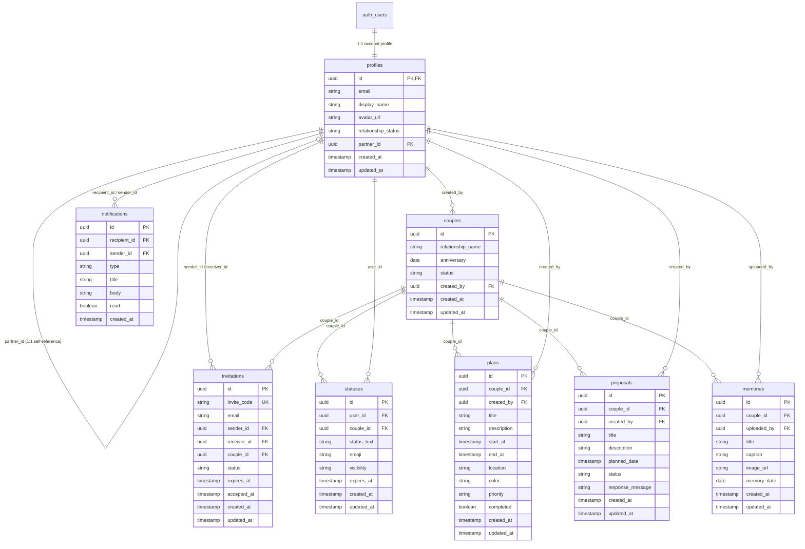

# SupaCouple Database Entity Relationship Diagram (ERD)

This document describes the relational architecture of the SupaCouple backend database in PostgreSQL / Supabase.

---

## ER Diagram (Mermaid)

---

## Detailed Relationship Explanations

1. **`auth.users` → `profiles` (1:1)**:
   - Each authenticated Supabase user has exactly one corresponding profile entry.
   - Primary Key `profiles.id` directly references `auth.users.id` with `ON DELETE CASCADE`.
   - Automated creation via `handle_new_user()` trigger on `auth.users`.

2. **`profiles` → `profiles` (Self-Referencing 1:1)**:
   - `profiles.partner_id` references another `profiles.id` representing the linked romantic partner.

3. **`profiles` → `couples` (1:N)**:
   - `couples.created_by` references the user profile who initialized the couple space.

4. **`couples` → `invitations` / `statuses` / `plans` / `proposals` / `memories` (1:N)**:
   - All shared couple features link to a central `couples.id` via Foreign Keys with `ON DELETE CASCADE`.

5. **`profiles` → `notifications` (1:N)**:
   - `notifications.recipient_id` references the profile receiving the in-app notification.
   - `notifications.sender_id` references the user triggering the notification (optional).
